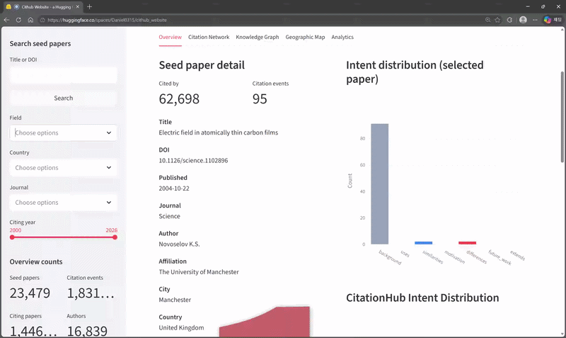

# CitationHub

[](https://citation-hub-website.vercel.app/)
[](https://seohyunnam.github.io/IDCite-Website/)
[](https://app.arcade.software/share/videos/82VtIYDsOhm1eMdnMzDf)
[](https://huggingface.co/spaces/Daniel0315/cithub_website)
[](https://huggingface.co/datasets/Daniel0315/CitationHub)
[](https://doi.org/10.5281/zenodo.20796923)

Explore influential papers, citation networks, citation contexts, and knowledge graphs across multidisciplinary scientific domains.


---

## Public Access

### CitationHub Website
https://citation-hub-website.vercel.app/

### IDCite Project Page
https://seohyunnam.github.io/IDCite-Website/

### Interactive Dashboard
https://citationdatabase.streamlit.app

### Hugging Face Space
https://huggingface.co/spaces/Daniel0315/cithub_website

### Hugging Face Dataset
https://huggingface.co/datasets/Daniel0315/IDCite

### Zenodo Record

**IDCite: A Large-Scale Multidisciplinary Citation Intent Dataset for Scholarly Knowledge Discovery (Version 3)**

[https://doi.org/10.5281/zenodo.20796923](https://doi.org/10.5281/zenodo.20796923)

---

##  Overview

CitationHub is a large-scale citation context database and interactive exploration platform designed to support:

* Citation Intent Classification
* Citation Recommendation
* Scholarly Retrieval
* Knowledge Graph Construction
* Contextual Citation Evaluation
* Research Trend Analysis
* Scientific Discovery Support

Unlike traditional citation databases that treat citations as simple links between papers, CitationHub preserves:

* citation context (actual citing sentence)
* citation intent labels (why the citation was made)
* multidisciplinary field information
* co-citation relationships
* citation event structures
* knowledge graph representation

This enables more fine-grained and explainable scholarly analysis.

---

## CitationHub and IDCite

The relationship between the two resources can be summarized as:

**IDCite → Structured data and knowledge graph layer**

**CitationHub → Interactive exploration and visualization layer**

IDCite provides the underlying citation events, contexts, intents, scholarly entities, and graph relationships, while CitationHub provides interfaces for interactively exploring and visualizing these resources.

CitationHub is therefore **not a separate version of the IDCite dataset**, but an application layer built on top of the IDCite data infrastructure.


##  Quick Demo Preview



The clip above is the **Streamlit dashboard** in this repository (`app.py`), not the CitationHub website. It is a lightweight IDCite browser: seed papers, citation contexts and intents, and simple network views, meant for anyone who wants a dashboard up quickly.

**🎥 See the Streamlit dashboard in action:** [Watch the interactive demo](https://app.arcade.software/share/videos/82VtIYDsOhm1eMdnMzDf)

---

## Main Features

The live interface is [CitationHub](https://citation-hub-website.vercel.app). Items follow the site’s navigation order, each a view over the same IDCite tables.

### 1. Search

Catalogue of the 23,479 highly cited **seed papers**.

* token-based search on titles and DOIs (not only exact strings)
* sidebar filters: **Field**, **Country**, **Journal**
* pagination and CSV export of the result list

Opening a card leads to **paper detail** (`/papers/[id]`):

| Tab | Content |
|---|---|
| Overview | Intent distribution and summary statistics |
| Citing Papers | Papers that cite this seed paper |
| Co-cited | Other seed papers co-cited with this one |
| Citation Contexts | In-text citation snippets |

The header carries title, field, country, DOI, cited-by count, citation-event count, journal, author, affiliation, and city, with shortcuts to the knowledge graph and a per-paper citation CSV.

---

### 2. Authors

Name search over seed-paper creators, grouped by `author_id`. Each result shows affiliation, country, primary field, number of seed papers, and total citations of those papers.

**Author detail** (`/authors/[id]`) adds:

* affiliations, fields, and countries
* seed-paper count, total citations, and citation-event count
* **Citation Intent Distribution** — why the author’s papers are cited
* citations over time
* top citing venues
* the author’s seed-paper list

---

### 3. Analytics

Corpus-wide statistics over all **1,857,503 citation events**:

| Panel | What it shows |
|---|---|
| Citation Intent Distribution | Counts for the seven canonical intents |
| Influential Citations | Share of events marked influential |
| Citation Intent Trend Over Time | Intent mix by citing year |
| Top Citing Venues | Journals and preprint servers that cite seed papers most often |

---

### 4. Geographic Map

Where seed-paper authors and affiliations are located. Three switchable layers on the same world map:

| Layer | What it draws |
|---|---|
| **By country** | Choropleth of paper counts (darker = more papers), with country names on the land |
| **By city** | One bubble per city, sized by paper count, labelled with the city name |
| **By affiliation** | One bubble per institution, sized by paper count, labelled with the institution name, each placed on its city |

* labels are placed automatically so they do not overlap; more names appear as you zoom in
* hover reports the paper count; bubble colors match the bar charts below the map (countries / cities / affiliations)

IDCite names every affiliation’s city and country but carries **no latitude or longitude**. CitationHub resolves 1,842 of 1,935 distinct city–country pairs against the [GeoNames](https://www.geonames.org) `cities500` gazetteer (CC BY 4.0) ahead of time (99.3% of papers that record a city) and ships that lookup with the application — nothing is geocoded at request time. Institutions sharing a city are fanned out around that shared point so each keeps its own bubble and label; the fan-out is a drawing device, not a measured campus location.

---

### 5. Citation Network

For a chosen seed paper, a force-directed **citation neighborhood** (not the full knowledge graph):

* the seed paper at the center
* citing papers as nodes, colored by primary intent (`background`, `uses`, `similarities`, `motivation`, `differences`, `future_work`, `extends`)
* node size reflects available citation-context evidence

Pan, zoom, and click a node for title, year, and intent; **View Detail** opens the paper page. Co-cited seed papers are on paper detail, not on this graph.

---

### 6. Knowledge Graph

A heterogeneous graph of **typed scholarly entities** around a seed paper.

**Knowledge Graph tab**

* node types: seed paper, citing paper, citation event, journal, author, affiliation, city, country, field, intent
* pan, zoom, and click a node for its type and label; edges are labelled

**Citation Event Schema tab**

* a `CitationEvent` links a `CitingPaper` to a `SeedPaper` with an intent
* seed papers further link to journals, authors, affiliations, geography, and fields

---

### 7. SPARQL

A read-only query console over the RDF conversion of that graph (about **25.1 million triples**).

* namespaces: resources `http://citationhub.org/id/`, ontology `http://citationhub.org/ontology/` (`ch:`)
* classes: SeedPaper, CitingPaper, CitationEvent, Author, Journal, Affiliation, City, Country, Field, Intent
* editor for SELECT / ASK / CONSTRUCT / DESCRIBE
* example queries (most-cited seed papers, intent distribution, top fields, top authors, top countries, total triples), ontology panel, results table, CSV download
* INSERT / DELETE and other update operations are rejected

The SPARQL engine is **QLever**; the public UI only sees the proxied explorer.

---

##  Key Statistics

IDCite Version 3 (the data layer CitationHub reads):

| Category          |     Count |
| ----------------- | --------: |
| Seed Papers       |    23,479 |
| Citation Events   | 1,857,503 |
| Citing Papers     | 1,467,045 |
| Authors           |    16,839 |
| Countries         |       108 |
| Scientific Fields |        21 |

The knowledge-graph tables add 3,418,433 nodes and 6,855,117 edges; the SPARQL index holds about 25.1 million triples. Home-page cards may differ slightly from these release counts (for example seven canonical intents versus 31 observed labels).

This makes CitationHub one of the largest multidisciplinary citation-context-aware resources.

---

##  Citation Intent Categories

CitationHub supports 7 major citation intent categories:

* Background
* Uses
* Similarities
* Motivation
* Differences
* Future Work
* Extends

These intent labels provide controllable and interpretable signals for:

* intent-aware citation retrieval
* reranking systems
* citation recommendation
* scholarly evaluation

---

##  Research Applications

### Intent-aware Citation Retrieval

Intent-conditioned citation recommendation and selective reranking, using the seven canonical intents and in-text citation contexts rather than citation counts alone.

### Scholarly Knowledge Graph Construction

Citation events → `kg_nodes` / `kg_edges` Parquet → N-Triples → QLever. The SPARQL explorer queries that graph with a small ontology (`ch:`).

### Contextual Citation Evaluation

Moving beyond simple citation counts toward semantic impact measurement — intent mix, influential-citation share, and citing venues.

### Research Trend Discovery

Field-specific citation behaviors and knowledge evolution analysis, including intent trends by citing year and geographic concentration of affiliations.

---


##  Repository Structure

```text
CitationHub/
├── app.py
├── requirements.txt
└── README.md
```


We are expanding CitationHub toward:

* full citation event ontology
* LLM-based citation reasoning
* agentic scholarly discovery systems
* explainable citation recommendation
* benchmark datasets for top-tier citation retrieval research

---

## Note

Readers should know that the code `app.py` provided in this repository is **not** the CitationHub system.
It is a **Streamlit dashboard** over IDCite: a compact, single-file prototype for browsing seed papers, citation events, intents, and simple network views.

If you want to stand up a dashboard on IDCite quickly, you can use `app.py` and `requirements.txt` in this repo. Point it at a local Parquet directory (`CITATIONHUB_DATA_DIR`) or a Hugging Face dataset (`HF_REPO_ID`).

---
